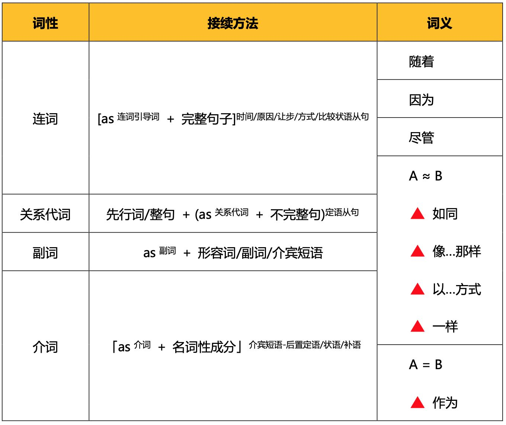

# USAGE OF 'AS'

## 1. 副词

as作为副词时，表示“同样地”意思。一般用来修饰形容词或者副词。例子：

> The book is **as** good
>
>这本书同样地好

## 2. 连词

as作连词时，连接两个完整的句子，并且此时as一般引导状语从句。

### 2.1 as 引导比较状语从句

> He sings as sweetly as Jenny. 

这个句子的第一个as做副词，第二个as做连词，引导比较状语从句。看起来Jenny并不是一个完整的句子，其实是因为部分成分被省略了，完整的句子如下：

> He sings as sweetly as Jenny sings sweetly.

为了严谨，这里省略的部分可用助动词代替：

> He sings as sweetly as Jenny does.

as 做连词时常常会出现【倒装】的情况

> Keats' letters are as much an indication of the man as is his poetry. （正常语序是 his poetry is)

as 后面的从句主语是【his poetry】，谓语是 is，为了避免头重脚轻，选择倒装。

### 2.2 as 引导方式状语从句，译作【方式如同...一样】

> He did not go to office daily, as his father did before.
>
> 他不像他父亲从前那样每天去办公室

### 2.3 as 引导时间状语从句，译作【随着...】

> As you are leaving last, please turn out the lights.

### 2.4 as 引导让步状语从句，译作【尽管】

as引导让步状语从句，需用部分倒装，一般将表语、状语或实义动词前置

#### 1. 表语前置

> Enviable as the cool kids may have seemed, Dr. Prinstein's studies show unpleasant consequences.
>
> 虽然这些酷孩子看起来令人羡慕，但普林斯坦博士的研究显示出了令人不快的后果

#### 2. 状语前置

> As much as some scientists may complain about the new awards, two things seem clear.

#### 3. 实义动词前置

> Try as he might, he could not forget it.

## as X as 常见搭配

as many as / as much as 多达

1. 作介词，往往后接数量词

> Diabete rates in 12 states have jumped significantly, now affecting as many as 12.2% of adults in Alabama——the state with the highest obesity rates.

2. 作连词，引导比较状语从句

> According to most calculations, race walkers moving at a pace of six miles per hour would burn about 800 calories per hour, which is approximately twice as many as they would burn walking, although fewer than running, which would probably burn about 1000 or more calories per hour.

as long as

1. 长达（本义）

> 长度：It is as long as the Nile and the Yangtze combined.
> 
> 时间：Her gaze returns; she lookds at it for twice as long as she did at the previous card.

2. 只要（引申义）

> as long as you love me.

as well as 

1. 一样好（本义）

> Other people say that you are illiterate if you think that you are illiterate. In other words, if you feel that you can't read or write as well as you would like to.

2. 也

> Attempts have been made to curb this tendency, for example, by trying to incorporate some measure of quality as well as quantity into assessment of an applicant's papers.

as soon as 一...就...

> As soon as i saw the location, i knew this was it.

## as词组

as follows 如下
as from / as of 自...起、截至到...
as for / as to / as regards 关于/至于
as against 和...相比
as and when 当...时
as if / as though 好像
such as 比如
so as to 为了
> Wireless devices will transmit signals so as to activate the alarm once something wrong is detected.
