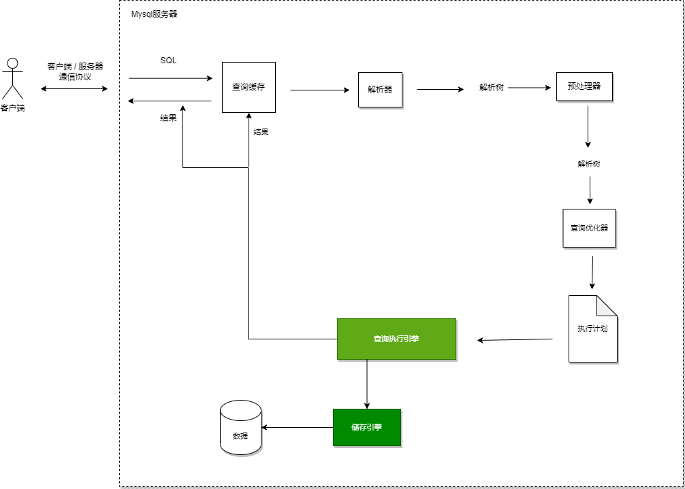

# about

* mysql 服务器层不管理事务，事务由储存引擎实现。如果在一个事务中混用事务型与非事务型储存引擎时，正常提交没问题；回滚时，非事务型储存引擎会无法回滚。

## Mysql 如何执行查询



1. 客户端发送查询给服务器；
2. 服务器先检查查询缓存，如命中直接返回储存结果。否则，进入下一阶段；
3. 服务器进行SQL解析、预处理，再由优化器生成执行计划；
4. Mysql根据执行计划，调用储存引擎API来执行查询；
5. 将结果返回给客户端。

### Mysql 客户端/服务器通信协议

Mysql客户端与服务器之间的通信协议是“半双工”的。这意味着，在任意时刻，只能从客户端发送数据到服务器，或者从服务器发送数据到客户端，不可能同时进行。我们无法也无需将消息切成小块独立发送。

这种协议让Mysql通信简单快速，但也限制了Mysql。一旦一端开始发送消息，另一端要接收完整个消息才能响应。

客户端使用单独的数据包将查询发送给服务器。当查询语句很长，超过 max_allowed_packet 时，服务器会拒绝继续接收消息，并报错。一旦客户端发送的请求，它就只能等待了。

### 查询状态

**Sleep**
<br>&emsp;&emsp;线程正在等待客户端发送新请求。

**Query**
<br>&emsp;&emsp;线程正在执行查询或正在将结果发送给客户端。

**Locked**
<br>&emsp;&emsp;在Mysql服务器层，该线程正在等待表锁。在储存引擎级别实现的锁，例如InnoDB的行锁，不会体现在线程状态中。

**Analyzing and statistics**
<br>&emsp;&emsp;线程正在收集储存引擎统计信息，并生成执行计划。

**Copying to tmp table [on disc]**
<br>&emsp;&emsp;线程正在执行查询，并将结果复制到一个临时表中，这种状态一般要么在做 GROUP BY，要么是在文件排序，或者是UNION操作。如果这个状态后面还有 "on disk" 标记，那表锁Mysql正在将一个内存临时表放到磁盘上。

**Sorting result**
<br>&emsp;&emsp;线程正在对结果进行排序。

**Sending data**
<br>&emsp;&emsp;这表示多种情况：线程可能在多个状态之间传送数据，或者在生成结果集，或者在向客户端返回数据。

### 语法解析器和预处理

在这一步，Mysql检查验证语法错误，还会进行权限验证。

### 查询优化器

现在语法树被认为是合法的了，将由优化器将其转化成执行计划。 Mysql使用基于成本的优化器。

有很多原因会导致Mysql优化器选择错误的执行计划，如下所示：

* 统计信息不准确。Mysql依赖储存引擎提供的统计信息来评估成本，但储存引擎之间提供的数据准确性不同。如：InnoDB因为其MVCC的架构，并不能维护一个数据表行数的精确统计信息。
* 执行计划中的估算成本不等同于实际执行的成本。如，某个执行计划虽然需要读取更多的页面，但它的实际成本却更小。因为这些页面都是顺序读或者页面都已在内存中。
* Mysql的最优可能和你想的最优不一样。我们可能希望执行时间尽可能的短，但Mysql只是基于成本模型选择最优的执行计划，有时，这并不是最快的执行方式。
* Mysql从不考虑其他并发执行的查询。
* Mysql并不总是基于成本进行优化。有时会基于一些固定的规则，例如，如果存在全文搜索的Match()子句，则在存在全文索引的时候就使用全文索引。即使有时使用别的索引和WHERE条件会执行的更快。
* Mysql不会考虑不受其控制的操作的成本，例如执行储存过程或者用户自定义函数的成本。
* 优化器有时无法估算所有可能的执行计划。

下面是一些Mysql能够处理的优化类型：

**重新定义关联表的顺序**
<br>&emsp;&emsp;数据表的关联并不总是按照查询中指定的顺序进行。

**将外连接转化成内连接**
<br>&emsp;&emsp;并不是所有的 OUTER JOIN语句都必须以外连接的方式执行。

**使用等价变换规则**
<br>&emsp;&emsp;Mysql可以使用一些等价变换来简化并规范表达式。如：(5=5 AND a>5)将被改写成 a >５。

**优化 COUNT()、MIN() 和 MAX()**
<br>&emsp;&emsp;。

**预估并转化为常数表达式**
<br>&emsp;&emsp;当Mysql检测到一个表达式可以转化为常数的时候，就会一直把该表达式作为常数进行优化处理。例如，一个用户自定义变量在查询中没有发生变化时就可以转化成一个常数。数学表达式则是另一种典型例子。甚至一个查询也能转化为一个常数，如，在索引列上执行MIN()。

**覆盖索引扫描**
<br>&emsp;&emsp;当索引中的列包含所有查询中需要使用的列时，Mysql就可以使用索引返回需要的数据，无需回表查询。

**子查询优化**
<br>&emsp;&emsp;Mysql在某些情况下可以将子查询转换为一种效率更高的形式，从而减少多个查询多次对数据的访问。

**提前终止查询**
<br>&emsp;&emsp;在发现已经满足查询需求时，Mysql总是能立刻终止查询。如，当使用LIMIT子句时。

**等值传播**
<br>&emsp;&emsp;如果两个列的值通过等式关联，那么Mysql能够把其中一个列的WHERE条件传递到另一列上。

**列表IN()的比较**
<br>&emsp;&emsp;在很多数据库系统中，IN完全等价于多个OR子句。Mysql会将IN列表的数据先排序，然后通过二分查找来确定列表中的值是否满足条件。

### 排序优化

Mysql有如下两种排序算法

**1. 两次传输排序（旧版本使用）**
<br>&emsp;&emsp;读取行指针和需要排序的字段，对其进行排序，然后再根据排序结果读取所需要的数据行。成本非常高。

**2. 单次传输排序（新版本使用）**
<br>&emsp;&emsp;先读取查询所需要的所有列，然后再根据给定列排序，最后直接返回排序后的结果。在Mysql4.1引入。这种排序方式会消耗大量内存，但效率更高。

两种算法都有优点和缺点。当查询需要所有列的总长度不超过max_length_for_sort_data时，使用“单次传输排序”。

在关联查询时，如果需要排序，Mysql会分两种情况来处理这样的排序。

1. 如果ORDER BY子句中的所有列都来自关联的第一个表，那么Mysql在关联处理第一个表时就进行文件排序，Extra字段显示 "Using filesort"。
2. 否则，Mysql会将关联结果存放在一个临时表中，然后在所有关联都结束后，再进行排序。Extra字段显示 "Using temporary; Using filesort"。

在Mysql5.6版本之前，查询中即使有LIMIT子句，Mysql也会先对所有数据排序后再应用LIMIT子句。在5.6版本后，Mysql会先抛弃不满足条件的结果，然后再进行排序。

### 关联子查询

Mysql 的关联子查询实现得很差。最糟糕的一类查询是WHERE条件中包含IN的子查询（呜呜呜）。

如，有如下子查询：

```mysql
SELECT * FROM sakila.film
    WHERE file_id IN(
        SELECT film_id FROM sakila.film_actor WHERE actor_id = 1;)
```

通常，我们会认为Mysql先执行子查询返回所有包含actor_id为1的film_id。很不幸，Mysql不是这样的。Mysql会将相关的外层表压到子查询中，它认为这样可以更高效率的找到数据行。Mysql会将查询改写成下面这样：

```mysql
SELECT * FROM sakila.film
    WHERE WXISTS(
        SELECT * film_id FROM sakila.film_actor WHERE actor_id = 1
        AND film_actor.film_id = film.film_id);
```

这时，子查询需要根据film_id来关联外部表film，因为需要film_id字段，所以Mysql认为无法先执行这个子查询。Mysql先选择对film表进行全表扫描，然后根据返回的film_id逐个执行子查询。我们可以用下面的方法来重写这个查询：

```mysql
SELECT film.* FROM sakila.film
    INNER JOIN sakila.film_actor USING(film_id)
        WHERE actor_id = 1;
```

#### 如何用好关联子查询

并不是所有关联子查询的性能都很差。很多时候，关联子查询是一种非常合理、自然，甚至是性能最好的写法。

如，我们希望获取所有包含同一个演员参演的电影，因为一个电影有很多演员参演，所以可能返回重复记录，需要使用DISTINCT：

```mysql
SELECT DISTINCG film.film_id FROM sakila.film
    INNER JOIN sakila.film_actor USING(film_id);
```

用上面的语句很难表达清楚“包含同一个参演演员”的逻辑。如果使用EXISTS，则很容易表达清楚此逻辑，而且不需要DISTINCT和GROUP BY，也不会参数重复的结果集，一旦使用DISTINCT和GROUP BY，那么通常会产生临时中间表。下面我们用子查询替换上面的关联：

```mysql
SELECT film_id FROM sakila.film
    WHERE EXISTS(SELECT * FROM sakila.film_actor
    WHERE film.film_id = film_actor.film_id);
```

### UNION 的限制

有时，Mysql无法将限制条件从外层下推到内层，这使得原本能够限制部分返回结果的条件无法应用到内层查询优化上。如果希望UNION的各个子句能够根据LIMIT只取部分结果集，或者希望能够先排好序再合并结果集的话，就需要在UNION的各个子句中分别使用这些子句。如：

```mysql
(SELECT first_name, last_name FROM sakila.actor ORDER BY last_name LIMIT 20)
UNION ALL
(SELECT first_name, last_name FROM sakila.customer ORDER BY last_name LIMIT 20)
ORDER BY last_name LIMIT 20;
```

### 等值传递

某些时候，等值传递会带来一些意想不到的额外消耗。例如，有一个非常大的IN()列表，而Mysql优化器发现存在WHERE、ON或者USING子句，将这个列表的值与另一个表的某个列相关联。那么优化器会将IN()列表都复制应用到关联的各个表中。通常，因为各个表新增了过滤条件，优化器可以更高效的从储存引擎过滤记录。但如果这个列表非常大，则会导致优化和执行都变慢。

### 优化关联查询

需要特别注意的是:

* 确保ON或者USING子句中的列上有索引。如果优化器的关联顺序是B、A，那么就不需要在B表的对应列上建立索引。一般来说，只需要在关联顺序中的第二个表的相应列上建立索引。
* 确保任何的GROUP BY和ORDER BY中的表达式只涉及到一个表中的列，这样Mysql才有可能使用索引来优化这个过程。
* 当升级Mysql时需要注意：关联语法、运算符优先级等其他可能会发生变更的地方。

### GROUP BY和DISTINCT优化

在很多情况下，Mysql都使用同样的办法优化这两种查询，事实上，Mysql优化器会在内部处理的时候相互转化这两类查询。在无法使用索引时，使用两种策略来完成这两种操作：使用临时表或者文件排序。SQL_BIG_RESULT 和 SQL_SMALL_RESULT 提示可控制使用何种策略。

如果需要对关联查询做 GROUP BY，并且是按照查找表中的某个列进行分组，那么通常采用查找表的标识列分组效率会比其他列更高。如：

```mysql
SELECT actor.first_name, actor.last_name, COUNT(*)
FROM sakila.film_actor
    INNER JOIN sakila.actor USING(actor_id)
GROUP BY actor.first_name, actor.last_name;
```

换成下面的写法效率更高：

```mysql
SELECT actor.first_name, actor.last_name, COUNT(*)
FROM sakila.film_actor
    INNER JOIN sakila.actor USING(actor_id)
GROUP BY film_actor.actor_id;
```

使用actor.actor_id列分组的效率甚至比使用film_actor.actor_id更好。这个查询利用了演员的姓名和ID直接相关的特点。服务器可能通过设置 SQL_MODE 来禁止这种写法，可通过MIN或者MAX来绕过：

```mysql
SELECT MIN(actor.first_name), MAX(actor.last_name) ...;
```

这种写法是不清晰的，但为了效率可以考虑。

并不是所有关联语句的分组查询都可以改写成在SELECT中直接使用非分组列的形式的。SELECT后面出现的非分组列一定是直接依赖分组列，并且在每个组内的值是唯一的，或者业务上根本不在乎这个值。

在分组查询的SELECT中直接使用非分组列通常不是什么好主意，当索引改变，或者优化器选择了不同的优化策略时都可能会导致结果不一致。建议始终使用含义明确的语法。将SQL_MODE设置为包含ONLY_FULL_GROUP_BY可以禁止此类查询。

如果没有通过 ORDER BY 子句显示指定排序列，当查询使用 GROUP BY 子句时，结果集会自动按照分组的字段进行排序。如果不关心结果集的顺序，可以使用 ORDER BY NULL。

在GROUP BY子句可以直接使用DESC或者ASC关键字使结果集直接排序。

### 优化LIMIT分页

通常使用LIMIT加上OFFSET的办法来实现分页。如果有对应索引，效率通常不错，否则会有大量文件排序操作。

当OFFSET非常大时，Mysql会做很多无用的工作，代价非常高。优化此类分页查询的一个最简单的办法是尽可能使用索引覆盖扫描，而不是查询所有的列。然后再根据需要做一次关联操作再返回所需的列。对于偏移量很大的时候，这样做效率提升很大，考虑一下查询：

```mysql
SELECT film_id, description FROM sakila.film ORDER BY title LIMIT 50, 5;
```

如果这个表非常大，查询最好改成以下形式：

```mysql
SELECT film.film_id, film.description
FROM sakila.film
    INNER JOIN (
        SELECT film_id FROM sakila.film
        ORDER BY title LIMIT 50, 5
    ) AS lim USING(film_id);
```

这里的延迟关联大大提示了查询效率，它让Mysql扫描尽可能少的页面。这个技术也可用于优化关联查询中的LIMIT子句。

有时也可将LIMIT查询转换成已知位置的查询，让Mysql通过范围扫描获得对应的结果。例如，已经知道下一次查询用的边界值，则上面的查询可改写成：

```mysql
SELECT film_id, description FROM sakila.film
WHERE film_id > 50 ORDER BY film_id LIMIT 5;

OR

SELECT film_id, description FROM sakila.film
WHERE film_id BETWEEN 51 AND 55 ORDER BY film_id;
```

### 优化SQL_CALC_FOUND_ROWS

分页的时候，另一个常用的技巧是在LIMIT语句中加上SQL_CALC_FOUND_ROWS提示，这样可以获得去掉LIMIT以后满足条件的行数。看起来Mysql使用了某种很高深的技术。实际上，Mysql是在扫描了所有满足条件的行以后，才能知道所有的行数。所以加上这个提示之后，Mysql都会扫描所有满足条件的行，然后抛弃不需要的行，而不是在获取到满足LIMIT行数后就终止扫描，所以该提示的代价可能非常高。

一个更好的设计是将具体的页数换成“下一页”按钮，假设每页需显示20条记录，那么，我们每次查询21条数据，如果第21条记录存在，则使下一页有效。

另一种做法是先获取较多行数，例如，缓存1000条，然后每次分页都从这个缓存获取。这样可以让应用程序根据结果集的大小采取不同的策略，如果结果集小于1000，则可以显示所有页数。如果结果集大于1000，则可将多出来的部分显示成 '...'。

有时，也可考虑使用EXPLAIN中的rows结果来作为结果集的近似值。当需要精确结果时，再使用COUNT(*)。

### 优化UNION查询

Mysql总是通过创建临时表的方式来执行UNION查询。因此很多优化无法使用。

除非确实需要服务器消除重复的行，否则一定要使用 UNION ALL，这很重要。如果没有ALL关键字，那么，Mysql会给临时表加上DISTINCT选项，这样做代价很高。

## 分区表

对用户来说，分区表是一个独立逻辑表，但底层有多个物理表实现。

Mysql实现分区表的方式——对底层表封装，导致了索引也是按照分区的子表定义的，而没有全局索引。

在下面的场景中，分区可以起很大作用：

* 表非常大以至于无法全部放在内存中，或者只有在表的最后部分有热点数据。
* 分区表的数据可以分布在不同的物理设备上，从而高效地利用多个硬件设备。
* 可以使用分区表来避免某些特殊的瓶颈，如InnoDB的单个索引的互斥访问。
* 可以备份和恢复独立的分区，这在非常大的数据集的场景下效果非常好。

分区表本身也有一些限制：

* 一个表最多只能有1024个分区。
* 在Mysql5.1中，分区表达式必须是整数，或者是返回整数的表达式。Mysql5.5中，某些场景中可以直接使用列来进行分区。
* 如果分区字段中有主键或者唯一索引的列，那么所有主键列和唯一索引列都必须包含进来。
* 分区表中无法使用外键约束。

### 分区表原理

分区表由多个相关的底层表实现，我们可以直接访问各个分区。储存引擎管理分区的各个底层表和管理普通表是一样的，分区表的索引只是在各个底层表上各自加上一个完全相同的索引。

分区表上的操作按照下面的操作逻辑进行：

#### SELECT查询

&emsp;&emsp;当查询一个分区表时，分区层先打开并锁住所有的底层表，优化器先判断是否可以过滤部分分区，然后再调用对应的储存引擎接口访问各个分区数据。

#### INSERT操作

&emsp;&emsp;当写入一条记录时，分区层先打开并锁住所有的底层表，然后确定接收这条记录，再将记录写入对应底层表。

#### DELETE操作

&emsp;&emsp;当删除一条记录时，分区层先打开并锁住所有的底层表，然后确定数据对应的分区，最后对相应底层表进行删除操作。

#### UPDATE操作

&emsp;&emsp;当更新一条记录时，分区层先打开并锁住所有的底层表，Mysql先确定需要更新的记录在哪个分区，然后取出数据并更新，再判断更新后的数据应该放在哪个分区，最后对底层表进行写入操作，并对原数据所在的底层表进行删除操作。

虽然每个操作都会“先打开并锁住所有的底层表”，但这并不是说分区表在处理过程中是锁住全表的。如果储存引擎能够自己实现行级锁，如InnoDB，那么Mysql会在分区层释放对应表锁。

### 如何使用分区表

如果数据量超大，那么为了保证大数据量的可扩展性，一般有下面两个策略：

* 全量扫描数据，不要任何索引: 可以简单的使用分区方式存放表，不要任何索引，根据分区的规则大致定位需要的数据位置。这个策略适用于以正常的方式访问大量数据的时候。**警告**：要将查询需要扫描的分区个数限制在一个很小的数量。
* 索引数据，并分离热点：如果数据有明显的热点，而且除了热点数据，其它数据很少被访问到，那么可以将这部分数据单独放到一个分区中，让这个分区有机会全缓存到内存中。这样，查询只需要访问很小的分区表，能够使用索引与缓存。

### 分区表陷阱

在 [如何使用分区表](#如何使用分区表) 一节中介绍的两个分区策略都基于两个非常重要的假设：查询都能够过滤(prunning)掉很多额外的分区、分区本身并不会带来很多额外的代价。而事实证明，这两个假设在某些场景下会有问题：

#### NULL值会使分区过滤无效

&emsp;&emsp;关于分区表一个很容易让人误解的地方就是分区表达式的值可以是NULL：第一个分区是特殊分区。假设按照PARTITION BY RANGE YEAR(order_date)分区，那么所有 order_date 为NULL或者是一个非法值的时候，记录都会被存放到第一个分区。假设有查询：WHERE order_date BETWEEN '2012-01-01' AND '2012-01-31'。实际上，Mysql会检查两个分区，而不是一个：它会检查2012这个分区以及第一个分区。

&emsp;&emsp;为了避免这种情况，可以创建一个“无用”的第一分区。如，上面的例子可以使用PARTITION p_nulls VALUES LESS THAN (0) 来创建第一个分区。如果插入的数据都是有效的，那么第一个分区就是空的，这样即使需要检查第一个分区，代价也不大。

&emsp;&emsp;在Mysql5.5中就不需要这个技巧了，因为可以直接使用列本身而不是基于列的函数进行分区：PARTITION BY RANGE COLUMNS(order_date)。

#### 分区列和索引列不匹配

&emsp;&emsp;如果定义的索引列和分区列不匹配，会导致查询无法进行分区过滤。应该尽量避免建立和分区列不匹配的索引，除非查询中还包含了可以过滤分区的条件。

&emsp;&emsp;这个问题听起来很好避免，不过有时会有一些意想不到的问题。例如，在一个关联查询中，分区表在关联顺序中是第二个表，并且关联使用的索引和分区条件并不匹配。那么关联时针对第一个表符合条件的每一行，都需要访问并搜索第二个表的所有分区。

#### 选择分区的成本可能很高

&emsp;&emsp;分区有很多类型，性能各不相同。

#### 打开并锁住所有底层表的成本可能很高

&emsp;&emsp;当查询访问分区表的时候，Mysql需要打开并锁住所有的底层表，这时分区表的另一个开销。这个操作在分区过滤之前发生，会影响所有的查询。

#### 维护分区的成本可能很高

&emsp;&emsp;有些维护分区表的操作成本很高，如：重组分区或者类似ALTER语句的操作————这类操作需要复制数据。

#### 分区表其他限制

* 所有分区都必须使用相同的储存引擎
* 分区函数中可以使用的函数和表达式也有一些限制
* 某些储存引擎不支持分区
* 对于MyISAM分区表，不能使用LOAD INDEX INTO CACHE操作
* 对于MyISAM表，使用分区表时，需要打开更多的文件描述符。

## 在Mysql内部储存代码

Mysql允许通过触发器、储存过程、函数以及定时任务（事件）的形式来储存代码。

在Mysql内部储存代码有以下优点：

* 它在服务器内部执行，离数据最近，可以节省带宽和网络延迟
* 这是一种代码重用。可以方便地统一业务规则，保证某些行为总是一致
* 它可以简化代码的维护和版本更新
* 它可以帮助提升安全，比如提供更细粒度的权限控制。一个常见的例子是银行用于转移资金的储存过程：这个储存过程可以在一个事务中完成资金转移和记录用于审计的日志。应用程序也可以通过储存过程的接口访问那些没有权限的表
* 服务器端可以缓存储存过程的执行计划，这对于需要反复调用的过程会大大降低消耗
* 因为是在服务器端部署的，所以备份、维护都可以在服务器端完成。所以储存程序的维护工作很简单
* 它可以在应用开发和数据库开发人员之间更好地分工。

储存代码也有一些缺点：

* Mysql本身没有提供好用的开发和调试工具
* 储存代码开发效率比应用程序代码要差一些。例如，储存代码中可以使用的函数非常有限，很难实现太复杂的逻辑
* 储存代码可能会给应用程序代码的部署带来额外的复杂性。原本只需要部署应用程序和库表结构，现在还需要部署储存代码
* 可能有安全隐患。如果将非标准的加密程序放在储存程序里，那么如果数据库被攻破，那么数据就泄露了
* 储存过程会给服务器增加额外的压力
* Mysql不能控制储存过程的资源消耗，所以储存过程可能会拖垮数据库
* 调试Mysql的储存过程是很困难的
* 它和基于语句的二进制日志复制配合的并不好。在基于语句的复制中，使用储存代码通常有很多的陷阱

## 绑定变量

客户端向服务器发送一个SQL语句原型。服务器接收到SQL语句框架后，解析并储存这个SQL语句的部分执行计划，返回给客户端一个句柄。如

```mysql
INSERT INTO tbl(col1, col2) VALUES (?, ?);
```

因为以下一些原因，Mysql以**二进制协议**使用绑定变量时可以更高效的执行重复的语句：

* 在服务器端只需要解析一次SQL语句
* 在服务器端某些优化器的工作只需要执行一次，因为部分执行计划会被缓存
* 以二进制的方式只发送参数和句柄比发送ASCII码更高效
* 仅仅是参数需要发送到服务器端
* Mysql在储存参数的时候，之间将其存放到缓存中，不再需要多次复制

绑定变量也更安全，无需在应用程序中处理转义，一则更简单，二则大大减少了SQL注入的风险。

### 绑定变量的限制

关于绑定变量的一些限制和注意事项：

* 绑定变量是会话级别的
* 在Mysql5.1版本之前，绑定变量不能使用查询缓存
* 绑定变量资源有总量限制，如果忘记释放资源，会发生资源泄露
* 有些操作，如BEGIN，无法在绑定变量中完成

## 字符集

### Mysql如何使用字符集

#### 创建对象时的默认设置

Mysql服务器、数据库、数据表都有自己的默认值。最终最靠近底层的默认设置将影响创建的对象：

* 创建数据库时，将根据服务器上的 character_set_server 设置来设定该数据库的默认值
* 创建表的时候，将默认根据数据库的设置指定表的设置
* 创建列的时候，默认根据表的设置指定列的设置

#### 服务器和客户端通信时的设置

* 服务器总是假设客户端按照 character_set_client 设置的字符来传输数据和SQL语句的
* 当服务器收到客户端的SQL语句时，它先将其转换成 character_set_connection。它还使用这个设置来决定如何将数据转换成字符串
* 当服务器返回数据时，它会将其转换成 character_set_result
